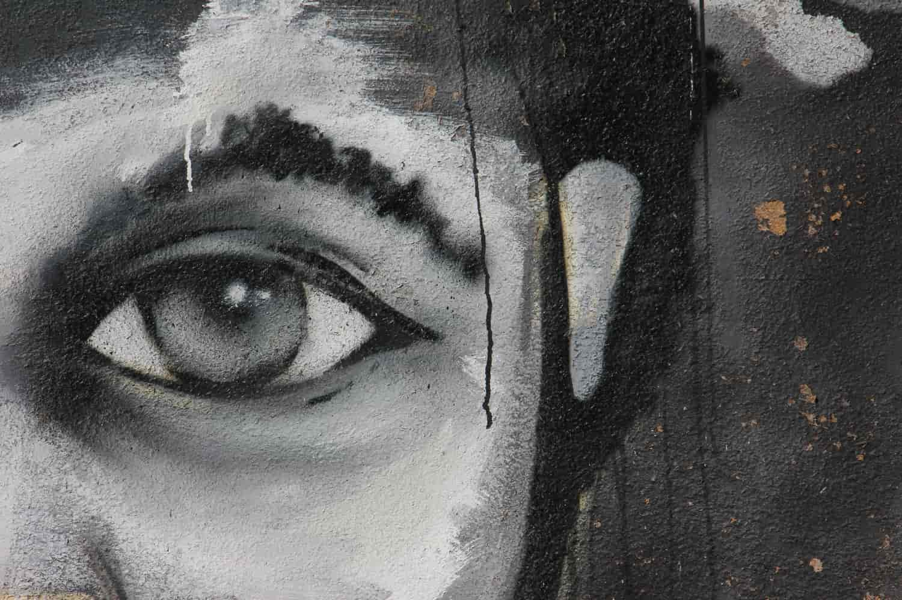

İndirgenme karşıtı çok çalgılı din'lerin 
Perdesi baget pelerinli sıradanı 
-Ölecek mi doktor? 
Şayet bahşetmediyse soloyla uzun vade, yaradanı 

Mensup olduğu payitahta 
Yumuşatıcı kokulu mensur 
Dişlerinden yükselecek 
Medeniyetsiz bir sur 
Elleri buruşuk, sesleri kemençe 
Tek başına arayacak bakışlarda kusur 

Şimdilik, sırasız, sıradanlar sence güruh 
Zaman makarasına asılı kalmışlığın 
Seni zaten ezbere yazmış 216 ferruh 
'hissikablelvuku' sanrısızları kurtarır lakin sen 
Tutuk görünümlü halbuki Mecruh 

Hi.ç  

> Newtown, Johannesburg, South Africa  
> Graffiti from Newtown Johannesburg tour in 2013. Love Jozi. Proudly South African. 
> Photo by Clodagh Da Paixao on Unsplash [@picsbylikesoda](https://unsplash.com/photos/llsCAW1nj2A)
