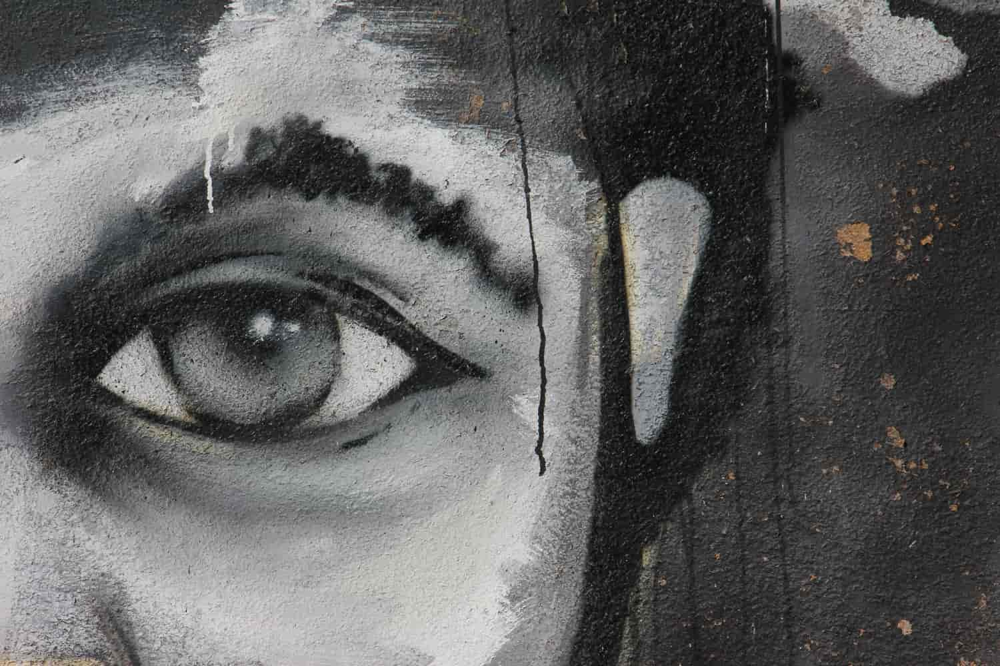

Rüyalarının ceketini astın, ön camını kapattın göğsünün,  
Barıştırdın dudaklarını ve somurtkanlara bitiştirdin 
Aynaya yekken yalnızca adaletin 
Hüviyetin, onun için toplumdan af diledin 

Bıyıklarını taradın sonra, pipona yeni tütünler ısmarladın 
Lacivert ağırladın dolabında, ataerkil kahveler, ağırbaşlı siyahlar 
Eteklerini yalınkat başkalarında hatırladın. 
Sızıntılı kırmızılarda yürüyen, çörekotu hayatını 
Onlar için ıskaladın 

> Newtown, Johannesburg, South Africa  
> Graffiti from Newtown Johannesburg tour in 2013. Love Jozi. Proudly South African. 
> Photo by Clodagh Da Paixao on Unsplash [@picsbylikesoda](https://unsplash.com/photos/llsCAW1nj2A)
